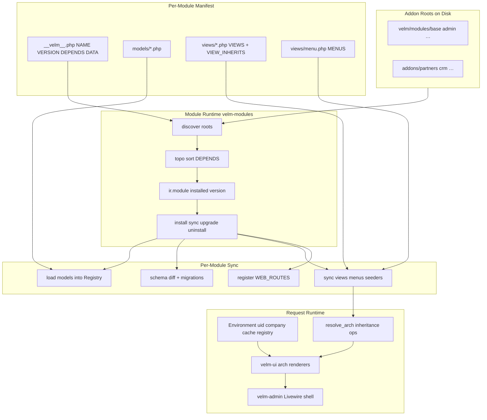
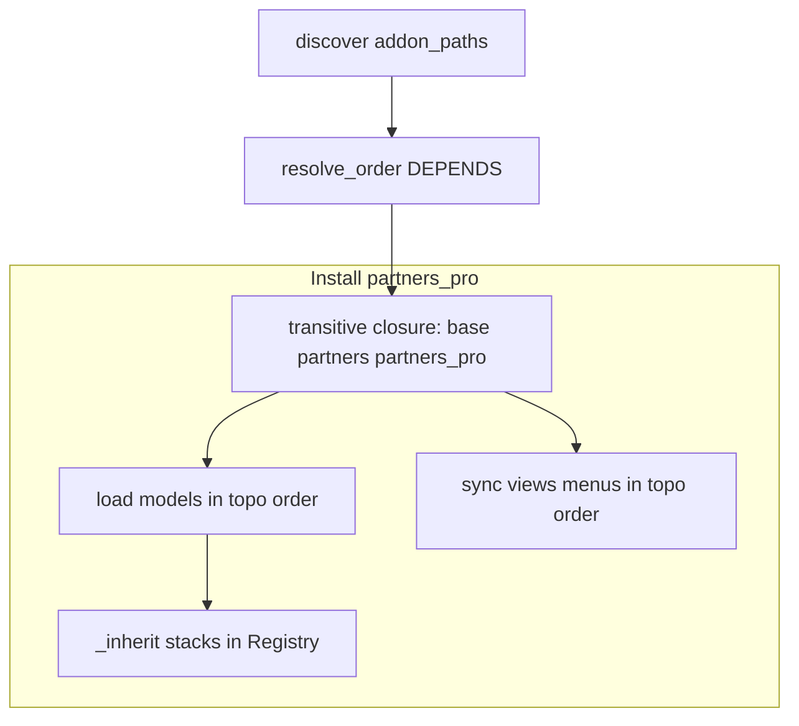
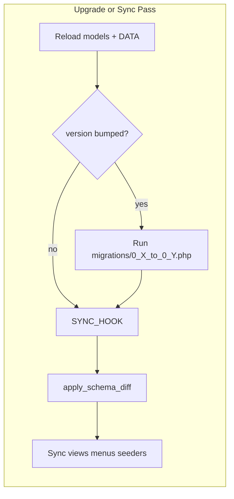
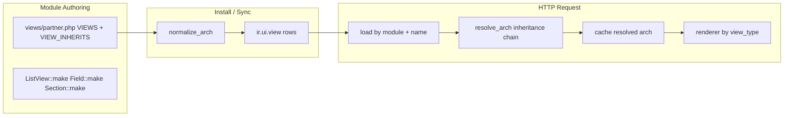
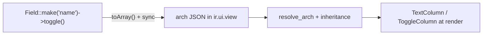
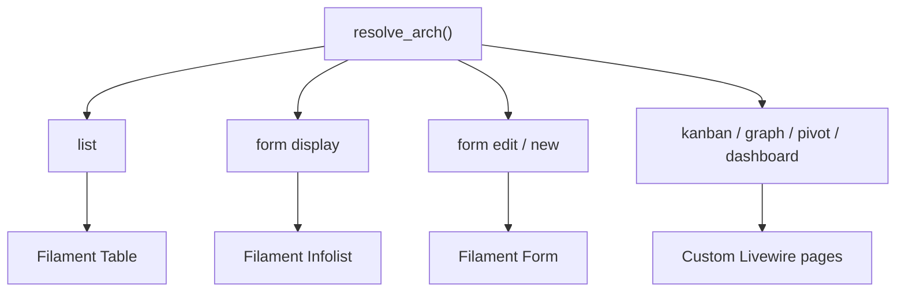
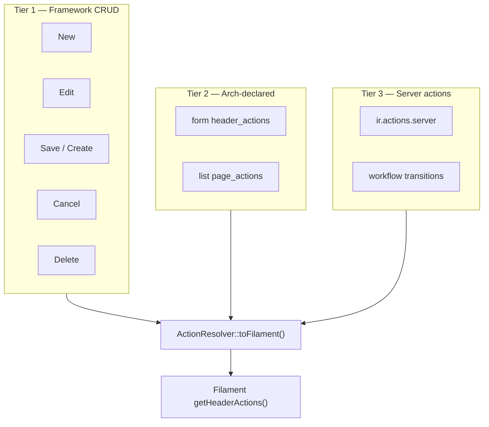
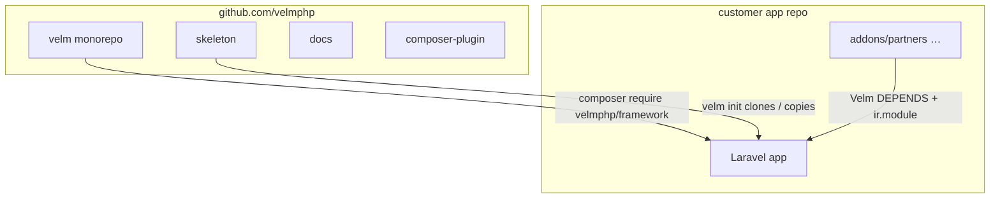
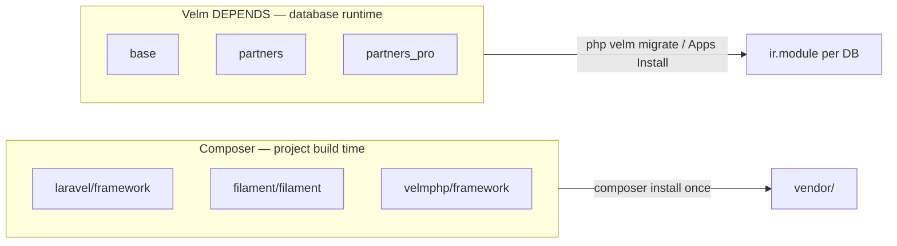

# PHP Velm on Laravel + Livewire — Feasibility Plan

## Verdict: feasible, with two architectural pillars to design

PyVelm was explicitly built as **“Odoo’s semantics, Laravel’s ergonomics, Filament’s craft”** ([README.md](README.md)). The PHP port should **not** use `nWidart/laravel-modules` or **filament-modules** — those are Laravel-package conventions, not Odoo/PyVelm module semantics. Instead, build a **first-class module runtime** ported from [loader.py](pyvelm/loader.py) and documented in [modules.md](docs/modules.md).

The two non-obvious design decisions:

1. **Custom module system** — discovery roots, `__velm__.php` manifests, `ir.module` install state, topological `DEPENDS`, Install/Sync/Upgrade/Uninstall lifecycle, Apps catalog.
2. **Arch as source of truth, Livewire as renderer** — JSON arch in `ir.ui.view` + `VIEW_INHERITS` ops ([views.py](pyvelm/views.py)), resolved at runtime into **velm-ui** Blade/Livewire components inside **velm-admin** shell pages. A Filament adapter remains an optional future path (see *Dual-renderer strategy* below); the shipping stack does **not** depend on Filament.

### Implementation snapshot (2026-06)

Monorepo status vs this plan — see [ROADMAP.md](./ROADMAP.md) for the checklist.

| Area | Status | Notes |
|------|--------|--------|
| Module runtime | **Done** | `ir.module`, install/sync/upgrade, `AppsCatalog`, skeleton `addons/` |
| ORM core | **Done** | Recordset, M2O/O2M/M2M, `$inherit`, `static::super()`, ACL + record rules |
| Migrations | **Done** | Schema diff, versioned scripts, `velm:db:*`, hooks |
| Views sync + resolve | **Done** | `ListView` / `FormView` / `DetailView`, `VIEW_INHERITS`, APIs |
| Admin shell | **Done** | `velmphp/admin` + `velmphp/ui` — PyVelm-style apps rail, list toolbar, forms |
| Apps catalog | **Done** | `/velm/apps`, dedicated catalog sidebar, sync/upgrade, module detail |
| Branding | **Done** | `res.company` fields + `CompanyBranding` + env fallbacks |
| Users / ACL UI | **Done** | `res.users` on Laravel `users`; admin views for groups, access, rules |
| List UX | **Done** | Click-to-open, icon row actions, ACL-gated delete, filter dropdown styling |
| Form UX | **Done** | `cols` / `colspan`, Ctrl+S, display/edit/create action bar |
| Relational UI | **Partial** | M2O combobox; M2M/O2M **record dialog** (`?embed=1`); kanban/graph not started |
| Public docs | **Done** | `website/docs` — [Admin panel](website/docs/guides/admin-panel.md), [Views and forms](website/docs/guides/views-and-forms.md) |
| Packagist split / `bin/velm` | **Open** | Dev uses path repos + `php artisan velm:*` only |

**Demo:** skeleton addon `demo_relations` (Projects / Tasks / Tags) exercises relational fields in the shell.




---

## Custom module system (Odoo/PyVelm-like — not filament-modules)

This is a **core framework feature**, not a third-party package. Port PyVelm’s loader semantics directly; Laravel is only the host (HTTP, DI container, Artisan, migrations tooling).

### Module shape on disk

Mirror PyVelm’s layout ([docs/modules.md](docs/modules.md)):

```
addons/partners/
├── __velm__.php              # manifest (NAME, VERSION, DEPENDS, DATA, …)
├── models/
│   ├── Partner.php
│   └── Tag.php
├── views/
│   ├── partner.php           # VIEWS, VIEW_INHERITS
│   └── menu.php              # MENUS
├── migrations/
│   └── 0_1_to_0_2.php
├── seeders/
│   └── PartnerSeeder.php
├── hooks.php                 # install() + sync() callables
└── routes.php                # optional WEB_ROUTES registrar
```

Bundled framework modules live under `velm/modules/` (equivalent to `pyvelm/modules/` + `BUILTIN_MODULE_ROOTS`).

### Manifest (`__velm__.php`)

PHP class or returned array — same keys as PyVelm’s `__pyvelm__.py`:


| Key                                                    | Purpose                                                            |
| ------------------------------------------------------ | ------------------------------------------------------------------ |
| `NAME`                                                 | Technical id (`partners`) — stored in `ir.module`                  |
| `VERSION`                                              | `[0, 1, 0]` — drives upgrade migrations                            |
| `DEPENDS`                                              | `['base']` — topological install order                             |
| `DATA`                                                 | `['views/partner.php', 'views/menu.php']` — declarative sync files |
| `INSTALL_HOOK`                                         | Callable run once on first install                                 |
| `SYNC_HOOK`                                            | Callable run on every sync/upgrade (idempotent backfills)          |
| `WEB_ROUTES`                                           | Callable registered after module install                           |
| `SEEDERS`                                              | Laravel-style seeder classes                                       |
| `SUMMARY`, `DESCRIPTION`, `CATEGORY`, `AUTHOR`, `ICON` | Apps catalog metadata                                              |


Discovery walks **addon roots** (config: `velm.addon_paths`), finds directories containing `__velm__.php`, builds `ModuleSpec` objects — same as `_read_manifest()` in [loader.py](pyvelm/loader.py).

### `ir.module` — install state in the database

PyVelm tracks installed modules in `ir_module` ([loader.py](pyvelm/loader.py) `IR_MODULE_TABLE`). The PHP port needs the same:

- `name`, `version`, `installed_at`
- Fresh DB: auto-install **bundled** modules under `velm/modules/` only
- Discovered addons outside the bundle: visible in **Apps** catalog, installed manually
- Install/Sync/Uninstall via **Apps UI** or CLI (`php velm migrate --module=partners`, `php velm module:sync partners`)

This is fundamentally different from nWidart (always-on package discovery) and filament-modules (Filament panel registration). Modules are **opt-in per database**, versioned, and upgradeable — exactly like Odoo/PyVelm.

### Install / Sync / Upgrade lifecycle

Port the loader pipeline from [loader.py](pyvelm/loader.py) `install()`:

1. **Discover** all manifests under addon roots
2. **Resolve order** — topological sort on `DEPENDS`; cycles and missing deps raise
3. **Load models** — import model classes into `Registry` inside `registry.activate()` scope
4. **First install** — run `INSTALL_HOOK`, insert `ir.module` row, apply schema
5. **Upgrade** — run version-gapped migration scripts (`migrations/0_1_to_0_2.php`), then schema diff
6. **Sync hook** — `SYNC_HOOK` on every sync (even when version unchanged)
7. **Reload DATA files** — harvest `VIEWS`, `VIEW_INHERITS`, `MENUS` from PHP data files
8. **Sync to DB** — `_sync_views`, `_sync_view_inherits`, `_sync_menus`
9. **Run seeders** — Laravel-style, module-scoped
10. **Register routes** — call `WEB_ROUTES` registrar for installed modules on boot
11. **Rebuild registry indexes** — O2M inverses, M2M junctions, compute deps

**Sync** (no version bump): reload DATA + re-sync views/menus + run `SYNC_HOOK` + schema additive diff — same as PyVelm **Apps → Sync**.

**Uninstall**: preview dependents, remove module row, optional schema cleanup (port PyVelm uninstall preview logic from [render.py](pyvelm/render.py)).

### Module dependencies (across bundled modules and addons)

Dependencies are **explicit in the manifest**, **validated at discovery/install**, and **enforced at uninstall** — same semantics as PyVelm [modules.md](docs/modules.md) and [loader.py `resolve_order`](pyvelm/loader.py).

#### What `DEPENDS` means

```php
// addons/partners_pro/__velm__.php
return [
    'NAME' => 'partners_pro',
    'VERSION' => [0, 1, 0],
    'DEPENDS' => ['partners'],   // transitive: partners already depends on base
];
```

| Rule | Behavior |
|------|----------|
| **Install order** | Topological sort; dependencies always install/sync before dependents |
| **Transitive closure** | `php velm migrate --module=partners_pro` installs `base` → `partners` → `partners_pro` if missing |
| **Missing dep** | Module on disk references `DEPENDS => ['foo']` but `foo` not discovered under any addon root → **hard error** at install/migrate |
| **Cycle** | `A → B → A` → **hard error** with cycle path in message |
| **Unlisted cross-ref** | Implicit references (below) do **not** auto-add deps — author must declare `DEPENDS` or install fails at sync time with a clear message |

`base` has `DEPENDS => []` and cannot be uninstalled.

#### Discovery roots (where modules come from)

```php
// config/velm.php
'addon_paths' => [
    base_path('velm/modules'),   // bundled: base, admin, workflow, …
    base_path('addons'),         // app-specific modules
    // env('VELM_ADDON_PATHS') — comma-separated extra roots
],
```

**Discover** walks all roots, finds `__velm__.php`, builds a flat `ModuleSpec` map keyed by `NAME`. Same module name in two roots is an error. Bundled + addon modules share one dependency graph.

#### Dependency graph at each lifecycle step



| Step | Dependency role |
|------|-----------------|
| **Model load** | Load packages in topo order so `_inherit` targets exist before extensions register |
| **Schema apply** | Owning module creates table; `_inherit` module adds columns on upgrade |
| **VIEW_INHERITS sync** | Parent view `(module, name)` must already exist — parent module must be installed **and** listed in `DEPENDS` |
| **Menu parent refs** | `parent=('admin', 'settings')` requires `admin` installed; recommend `DEPENDS => ['admin', …]` |
| **WEB_ROUTES** | Only **installed** modules register routes, in dep order ([loader `register_web_routes`](pyvelm/loader.py)) |
| **Seeders / hooks** | Run per module during its install pass, after its deps |

#### Cross-module references (author checklist)

Authors must align `DEPENDS` with cross-module references:

| Reference type | Example | Required dep |
|----------------|---------|--------------|
| `_inherit` model | `partners_pro` extends `res.partner` | `'partners'` |
| `VIEW_INHERITS` | `extends('partners.partner.list')` | `'partners'` |
| Menu parent tuple | `parent=('admin', 'settings.reference')` | `'admin'` |
| View in another module | `ChartWidget::view('crm.lead.graph')` | `'crm'` |
| `ir.actions.server` target model | action on `res.partner` | module owning that model |

**Optional lint** (`php velm module:lint partners_pro`): scan DATA files for `module.name` refs and warn when absent from `DEPENDS`.

#### Apps catalog dependency UX

Port PyVelm `/web/apps` behavior ([modules.md Apps catalog](docs/modules.md)):

- Each card lists manifest `DEPENDS`
- Dep names shown **red** when that module is not installed
- **Install** button disabled until all deps are installed (or will be installed transitively)
- **Install** on `partners_pro` runs transitive closure automatically — user does not install deps manually one by one

#### Uninstall and reverse dependencies

Before uninstall, run `uninstall_preview` (port [render.py](pyvelm/render.py)):

| Blocker | Reason |
|---------|--------|
| Target is `base` | System module |
| **Reverse deps** | Any **installed** module whose manifest still lists target in `DEPENDS` (e.g. cannot uninstall `partners` while `partners_pro` installed) |
| **`_inherit` extensions** | Another module extended this module's models — orphan columns on shared tables |

Uninstall order for a chain: remove dependents first (`partners_pro` before `partners`).

#### Fresh database bootstrap

| State | Auto-installed modules |
|-------|------------------------|
| Empty `ir.module` | Bundled **`base`** + **`admin`** only (configurable `velm.bootstrap_modules`) |
| Addons on disk | Visible in Apps; not installed until explicit Install / `migrate --module` / `--all` |

This matches PyVelm: discovery ≠ installation.

#### CLI dependency flags

```bash
php velm migrate --module=partners_pro   # installs deps first (topo closure)
php velm migrate --all                   # every discovered module
php velm module:install partners_pro     # same closure via Apps logic
php velm module:list                     # discovered vs installed + dep status
php velm module:lint partners_pro        # optional: validate DEPENDS vs cross-refs
```

### Scheduled jobs — Laravel Scheduler (not a standalone cron daemon)

PyVelm ships a long-running `pyvelm cron` loop ([cron.py](pyvelm/cron.py), [cli.md](docs/cli.md)). The PHP port **does not** replicate that daemon. Use **Laravel's scheduler** as the host tick; Velm owns **`ir.cron` job definitions** and **`CronJob::runDue()`** execution — same split as PyVelm's design ("host calls `run_due` at whatever cadence").

#### What stays in Velm (ORM layer)

Port unchanged from PyVelm:

- **`ir.cron`** model — `name`, `action_id` (M2O `ir.actions.server`), `interval_number`, `interval_type`, `nextcall`, `lastcall`, `active`
- **`CronJob::runDue(Environment $env)`** — query active jobs where `nextcall <= now`, execute linked server action, advance `nextcall`
- Jobs seeded in module **`INSTALL_HOOK`** (e.g. base mail dispatcher, workflow sweeps) — installing `base` creates cron rows

#### Laravel integration

**One Artisan command** — thin wrapper:

```php
// app/Console/Commands/VelmCronRun.php  (or auto-registered by velm-modules)
// Signature: velm:cron:run
public function handle(VelmKernel $velm): int
{
    $env = $velm->environment();  // uid=1 / superuser for cron
    $executed = CronJob::runDue($env);
    $this->info('Executed: '.implode(', ', $executed));
    return self::SUCCESS;
}
```

**Register on the scheduler** (`routes/console.php` or `bootstrap/app.php`):

```php
use Illuminate\Support\Facades\Schedule;

Schedule::command('velm:cron:run')->everyMinute();
```

Production crontab (standard Laravel):

```bash
* * * * * cd /path-to-app && php artisan schedule:run >> /dev/null 2>&1
```

**Why every minute:** `ir.cron` rows carry their own `interval_number` / `interval_type` / `nextcall` — the scheduler tick is a poll; individual jobs fire only when due (same as PyVelm's 60s loop calling `run_due`).

#### What we do NOT ship

| PyVelm | PHP Velm |
|--------|----------|
| `pyvelm cron` long-running process | **Removed** — use `schedule:run` |
| Dedicated `cron` Docker service | Single app container + system crontab, or Laravel Cloud scheduler |
| `php velm cron --interval=60` | `Schedule::command('velm:cron:run')->everyMinute()` (configurable to `->everyFiveMinutes()` if desired) |

Optional **dev convenience** (not production): `php velm schedule:work` alias wrapping `php artisan schedule:work` — runs the scheduler loop locally without system cron.

#### Docker / deploy

Scaffolded `docker-compose.yml`:

- **App** service runs `php-fpm` + web
- **Scheduler** — either host crontab on app container entrypoint hook, or a lightweight sidecar running `schedule:work` in dev
- Document in README: production uses one `schedule:run` crontab entry per app instance (avoid multiple schedulers racing — same guidance as PyVelm's single cron worker)

#### Phase placement

- **Phase 2**: port `ir.cron` model + `runDue()` + base module mail-dispatcher seed
- **Phase 2b**: `velm:cron:run` command + `Schedule::everyMinute()` in app skeleton
- **Phase 5**: workflow/report cron jobs from module hooks

### Apps catalog

Port PyVelm’s `/web/apps` UI: list discovered modules with catalog metadata, show installed vs available, Install/Sync/Uninstall actions gated by ACL. This is part of the `admin` bundled module, not a Filament plugin concern.

### What we explicitly do NOT use


| Package                   | Why not                                                                                                |
| ------------------------- | ------------------------------------------------------------------------------------------------------ |
| `nWidart/laravel-modules` | Always registers providers at boot; no `ir.module` install state; no Odoo-style upgrade/sync/uninstall |
| `filament-modules`        | Filament-centric panel wiring; does not own ORM loading, schema diff, or declarative DATA sync         |


Filament remains a **UI renderer** inside the Velm shell. Module lifecycle is owned entirely by `velm-modules`.

---

## Migrations (two-layer Odoo/PyVelm model — not Laravel's global migrations)

PyVelm deliberately separates **automatic schema sync** from **versioned migration scripts** ([migrations.md](docs/migrations.md)). The PHP port should preserve this exactly. **Do not** use Laravel's `database/migrations/` as the primary mechanism for Velm model tables — those migrations are app-global, not tied to `ir.module` install state or per-module `VERSION`.

Laravel's **Schema Builder** is reused as the DDL engine underneath; Velm owns **when** and **what** runs.

### The two layers

| Layer | When it runs | What it does |
|-------|--------------|--------------|
| **Model-driven diff** | Every install, upgrade, and Sync | Compare declared fields on loaded models to live Postgres schema |
| **Schema apply** | Same pass, after hooks | Create tables/columns; safe nullability changes (`SET NOT NULL` only when no NULL rows) |
| **`SYNC_HOOK`** | Before schema apply on every upgrade/Sync/migrate | Idempotent backfills, orphan-column drops — makes `SET NOT NULL` succeed in the same pass |
| **Migration scripts** | Only when `ir.module.version` < manifest `VERSION` | `migrations/0_1_to_0_2.php` — irreversible or version-gapped DDL |



### What schema diff auto-applies vs requires manual work

Port [db_autogen.py](pyvelm/db_autogen.py) `compute_diff` / `apply_schema_diff`:

| Change | Auto on migrate/Sync? | Where to handle if not |
|--------|----------------------|------------------------|
| New table / column | Yes | — |
| Relax nullability (`required=False`) | Yes (`DROP NOT NULL`) | — |
| Tighten nullability (`required=True`, no NULL rows) | Yes (`SET NOT NULL`) | — |
| Tighten nullability (NULL rows exist) | No | **`SYNC_HOOK`** backfill first, then re-migrate |
| Column type change | No | Versioned migration script with `USING` cast |
| Column removed from model (orphan) | No | **`SYNC_HOOK`** or versioned migration |

This matches Odoo's "change the model, upgrade applies columns" workflow while keeping dangerous DDL explicit.

### Per-module versioned migration scripts

Same convention as PyVelm ([loader.py](pyvelm/loader.py) `_run_migrations`):

- Files live in `addons/partners/migrations/`
- Filename: `0_1_to_0_2.php` maps to `VERSION` going from `(0, 1, 0)` → `(0, 2, 0)`
- Each file exports `upgrade(Environment $env): void`
- Scripts run **once per version gap**, strictly between recorded `ir.module.version` and manifest version
- **Skipped on Sync** when versions already match (common day-to-day path)

Port PyVelm's declarative **`Schema` API** ([migrations/schema.py](pyvelm/migrations/schema.py)) — Laravel Blueprint-like builders, no raw SQL in module scripts for common cases:

```php
// addons/partners/migrations/0_1_to_0_2.php
use Velm\Migrations\Schema;
use Velm\Migrations\Table;

function upgrade(Environment $env): void
{
    Schema::make($env)->table('res_partner', function (Table $t) {
        $t->string('code', nullable: true);
    });
}
```

Real example in Python: [partners/migrations/0_1_to_0_2.py](examples/modules/partners/migrations/0_1_to_0_2.py).

Implementation: wrap `Illuminate\Database\Schema\Builder` behind Velm's `Schema`/`Table`/`Blueprint` facades so module authors never touch Laravel's migration classes directly.

### SYNC_HOOK vs INSTALL_HOOK vs seeders

| Hook | Frequency | Purpose |
|------|-----------|---------|
| **`INSTALL_HOOK`** | Once on first install | ACL rules, baseline config ([partners/hooks.py install](examples/modules/partners/hooks.py)) |
| **`SYNC_HOOK`** | Every Sync / upgrade / migrate | Idempotent backfills before schema apply ([partners/hooks.py sync](examples/modules/partners/hooks.py)) |
| **Seeders** | After schema apply on install/upgrade | Demo/reference data (Laravel-style, module-scoped) |

Example: adding required `code` to `res.partner`:
1. Migration script adds nullable column (version bump)
2. `SYNC_HOOK` backfills `code` from `name + id` on every Sync until clean
3. Schema diff applies `SET NOT NULL` once no NULL rows remain

### `_setup_table` on first install

Before diff on a brand-new module, run `_setup_module_schema` ([loader.py](pyvelm/loader.py)):
- `CREATE TABLE` for new models
- `ALTER TABLE ADD COLUMN` for `_inherit` extensions on existing tables
- FK and M2M junction table setup

This is idempotent and runs per module during install.

### CLI commands (see dedicated section below)

Migration and module lifecycle are driven by **`php artisan velm:*`**. Key commands: `velm:migrate`, `velm:db:diff`, `velm:db:autogen`, `velm:db:status`.

Deploy pattern (same as PyVelm): run `php velm migrate` **once** before workers start; app boot may call `load_and_install` idempotently as a safety net.

### Relationship to Laravel migrations

| Concern | Owner |
|---------|-------|
| Velm model tables (`res_partner`, `ir_module`, …) | **Velm** diff + per-module scripts |
| Laravel infrastructure (optional: `jobs`, `cache`, `sessions`) | Standard Laravel `database/migrations/` in the app skeleton |
| Migration execution tracking for Velm modules | **`ir.module.version`** + optional `ir.module.migration` log — **not** Laravel's `migrations` table |

Keeping these separate avoids Laravel running module DDL out of dependency order and prevents conflicts with Odoo-style Sync (which must re-apply additive diff without re-running versioned scripts).

### Developer loop (document in velm docs)

1. Edit model fields in `addons/partners/models/`
2. `php velm db:diff partners` — inspect delta
3. `php velm db:autogen partners` — bumps `VERSION`, scaffolds `migrations/*_to_*.php`
4. Add backfills to `SYNC_HOOK` if tightening nullability on existing rows
5. `php velm migrate` or Apps → Upgrade
6. Commit migration file + bumped `VERSION`

### Phase placement

- **Phase 1**: `_setup_table` + basic `apply_schema_diff` (new tables/columns only)
- **Phase 2**: Full diff detection, nullability apply, `_run_migrations`, `SYNC_HOOK` ordering, CLI (`db:diff`, `migrate`, `db:status`)
- **Phase 2b**: `db:autogen` scaffolding + `Schema` API port + `make:*` generators; `velm:cron:run` + Laravel Scheduler
- **Phase 5+**: `migrate:fresh`, production confirmation prompts, Docker migrate service

---

## CLI (`php artisan velm:*` — primary entry point)

**Implemented today:** all Velm commands register on **Laravel Artisan** from a bootstrapped app (e.g. `apps/skeleton`). There is no supported standalone `php velm` binary.

```bash
php artisan velm:migrate --module=partners
php artisan velm:module:sync partners
php artisan velm:db:diff --module=partners
php artisan list velm
```

Naming uses a `velm:` prefix (like `queue:work`), not PyVelm's space-separated `pyvelm db diff`. Standard Laravel infra (`queue:work`, `cache:clear`, etc.) stays on `php artisan`.

The tables and examples below that say `php velm …` mean **`php artisan velm:…`** (e.g. `php velm migrate` → `php artisan velm:migrate`).

### Implementation

| Piece | Approach |
|-------|----------|
| **Binary** | `bin/velm` in project root + `vendor/bin/velm` via Composer (`"bin": ["bin/velm"]`) |
| **Bootstrap** | Boot Laravel application kernel (same as `artisan`) for DB, config, `.env` |
| **Console** | Symfony Console with **colon namespaces** (`db:diff`, `make:model`, `module:sync`) |
| **Base class** | `Velm\Console\Command` — port of [pyvelm.console.Command](pyvelm/console.py) with `$signature`, `handle()`, `info()`/`warn()`/`error()` |
| **Module commands** | Auto-discover `Command` subclasses in `addons/*/commands/*.php`; optional `COMMANDS` key in `__velm__.php` |
| **Discovery** | `php velm list` shows **Core** + **Module** command groups (same as [console.md](docs/console.md)) |

PyVelm command mapping (Python → PHP):

| PyVelm (legacy) | PHP Velm (Artisan-style) |
|-----------------|--------------------------|
| `pyvelm db diff` | `php velm db:diff {module?}` |
| `pyvelm db status` | `php velm db:status` |
| `pyvelm db autogen` | `php velm db:autogen {module} {--with-views}` |
| `pyvelm db migrate` / `pyvelm migrate` | `php velm migrate {--module=} {--all}` |
| `pyvelm migrate:fresh` | `php velm migrate:fresh {--all} {--yes}` |
| `pyvelm migrate:reset` | `php velm migrate:reset {--yes}` |
| `pyvelm db nuke` | `php velm db:nuke {--yes}` |
| `pyvelm make:module` | `php velm make:module {name}` |
| `pyvelm make:model` | `php velm make:model {model} {--module=}` |
| `pyvelm make:view` | `php velm make:view {model} {--module=} {--minimal}` |
| `pyvelm make:menu` | `php velm make:menu {--view=} {--module=} {--append}` |
| `pyvelm make:command` | `php velm make:command {name} {--module=}` |
| `pyvelm make:stubs` | `php velm make:stubs` |
| `pyvelm init` | `php velm init {name}` |
| `pyvelm new` | `php velm new {module}` (alias → `make:module`) |
| `pyvelm serve` | `php velm serve {--host=} {--port=} {--reload}` |
| `pyvelm test` | `php velm test {--coverage} {--integration}` |
| `pyvelm test` | `php velm test {--coverage} {--integration}` |
| (cron via scheduler) | `php artisan schedule:run` + `velm:cron:run` every minute |

### Full command catalog

**Scaffolding & generators**

```bash
php velm init my_erp
php velm make:module partners
php velm make:model res.partner --module=partners
php velm make:view res.partner --module=partners
php velm make:menu --view=partner.list --module=partners
php velm make:command partners:import --module=partners
php velm make:stubs
```

**Database & migrations**

```bash
php velm db:diff partners
php velm db:autogen partners --with-views
php velm db:status
php velm migrate                          # upgrade installed modules
php velm migrate --module=partners        # one module + dependencies
php velm migrate --all                    # CI / demo: every discovered module
php velm migrate:fresh                    # DEV: drop Velm schema, re-migrate
php velm migrate:reset                  # DEV: drop schema only
php velm db:nuke                          # DEV: drop + reinstall --all
```

**Module lifecycle** (also available in Apps UI)

```bash
php velm module:install partners
php velm module:sync partners             # reload DATA, no version bump
php velm module:uninstall partners
php velm module:list                      # discovered vs installed
```

**Data**

```bash
php velm seed                             # all module seeders (installed modules)
php velm seed --module=partners
php velm seed --class=PartnersSeeder
```

**Runtime & dev**

```bash
php velm serve --reload
php velm test
php velm list
php velm help make:model
# Cron: Laravel scheduler (production)
php artisan schedule:run          # crontab every minute
php artisan velm:cron:run         # run due ir.cron jobs once
php artisan schedule:work         # dev: local scheduler loop
```

**Module-owned commands** (namespaced, like Laravel packages)

```bash
php velm partners:import --file=data.csv
```

### Typical developer workflow

```bash
cd my_erp
php velm make:module inventory
php velm make:model inventory.product --module=inventory
php velm make:view inventory.product --module=inventory
php velm make:menu --view=product.list --module=inventory
php velm db:diff inventory
php velm db:autogen inventory --with-views
php velm migrate --module=inventory
php velm seed --module=inventory
php velm serve --reload
```

### Relationship to `php artisan`

| Concern | CLI |
|---------|-----|
| Velm modules, ORM schema, generators, seeders | **`php velm`** |
| Laravel queue, cache, horizon, telescope | **`php artisan`** |
| Laravel app migrations (`jobs`, `sessions`) | **`php artisan migrate`** |

No duplicate registration — Velm commands live only on `bin/velm`. The Velm service provider may register nothing on Artisan, or only hidden aliases for CI convenience.

### Phase placement

- **Phase 0**: `bin/velm` skeleton, `list`/`help`, Laravel bootstrap
- **Phase 0b**: `migrate`, `module:install`, `module:sync`, `module:list`
- **Phase 2**: `db:diff`, `db:status`, `db:autogen`, `migrate:fresh`
- **Phase 2b**: `make:module`, `make:model`, `make:view`, `make:menu`, `seed`
- **Phase 3+**: `make:command`, module command discovery, `serve`, `cron`, `test`

---

## What maps cleanly (beyond modules)

### Menus

- Persist `ir.ui.menu` (mirror [menu model](pyvelm/modules/base/models/menu.py))
- Port `Menus` builder API ([builders.py](pyvelm/builders.py)) — [partners/views/menu.py](examples/modules/partners/views/menu.py)
- Port `build_menu_tree()` + ACL pruning ([menu.py](pyvelm/menu.py))
- Navigation populated from DB at request time (Filament panel or custom layout), respecting apps vs sidebar layout

### Views

See **View layer (detailed plan)** below.

### Models (full fidelity)


| PyVelm concept                    | PHP implementation                                   |
| --------------------------------- | ---------------------------------------------------- |
| `Environment`                     | Request-scoped `Velm\Environment` in middleware      |
| Recordset-is-the-model            | `Velm\Model` wrapping `(Environment, int[] $ids)`    |
| `Field` descriptors               | PHP attributes scanned at model boot                 |
| `env.cache`                       | Request-scoped `FieldCache` — not on model instances |
| `Registry` + `env["res.partner"]` | Populated during module load; supports `_inherit`    |
| `_inherit`                        | Boot-time class composition replacing registry entry |
| Domain compiler                   | Custom `DomainCompiler` → query builder              |
| ACL + record rules                | Global scopes + gates                                |


Reference port order: [model.py](pyvelm/model.py), [fields.py](pyvelm/fields.py), [registry.py](pyvelm/registry.py), [env.py](pyvelm/env.py).

---

## View layer (detailed plan)

The view layer is **declarative data**, not PHP view classes. Module authors ship JSON arch in DATA files; the loader syncs to `ir.ui.view`; at request time the framework **resolves inheritance**, binds to the ORM model, and **renders** through a widget registry. This is the piece that must preserve Odoo/PyVelm semantics while using Filament + Livewire on Laravel.

PyVelm reference: [views.md](docs/views.md), [inheritance.md](docs/inheritance.md), [types.py](pyvelm/types.py), [views.py](pyvelm/views.py), [render.py](pyvelm/render.py), [web.py](pyvelm/web.py).

### Mental model



**Views are not Filament Resource classes.** Filament (and custom Livewire) are **renderers** that consume resolved arch. Cross-module extension (`partners_pro` patching `partners.partner.list`) works because patches are **operations on stored arch**, not edits to PHP classes.

### Persistence: `ir.ui.view`

Port [View model](pyvelm/modules/base/models/view.py):

| Field | Role |
|-------|------|
| `module`, `name` | Identity — `(partners, partner.list)` |
| `model` | Dotted model name — `res.partner` |
| `view_type` | `list`, `form`, `kanban`, `graph`, `pivot`, `dashboard` |
| `arch` | JSON (normalized on write) |
| `priority` | Inheritance ordering (default 16) |
| `inherit_id` | M2O to parent view (extension records only) |
| `operations` | JSON op list (extension records only; `arch` is null) |

**Base view** — has `arch`, no `inherit_id`.
**Extension view** — has `operations` + `inherit_id`; `model`/`view_type` copied from parent on sync ([loader `_sync_view_inherits`](pyvelm/loader.py)).

Sync on every module install/upgrade/Sync — same as PyVelm. Changing `VIEWS` in PHP requires `php velm module:sync partners` (or Apps → Sync).

### Authoring API — fluent class builders (Filament DX, arch output)

PyVelm Python uses functional helpers (`list_view()`, `field()`). The PHP port should feel like **Filament authoring**: static `make()` entry points, fluent method chains, composable layout objects. Under the hood everything still serializes to the **same JSON arch** PyVelm stores — builders are authoring sugar only; the loader calls `toArray()` before `normalize_arch()`.

**Two layers, same vocabulary:**

| Layer | What the author writes | What runs at request time |
|-------|------------------------|---------------------------|
| **Authoring** (`velm-views`) | `Field::make('name')` → arch dict | — |
| **Rendering** (`velm-admin`) | — | arch dict → `TextColumn::make('name')` |

Authors learn Filament-shaped names once; inheritance and sync stay arch-based.

#### Core pattern

Every builder implements `Velm\Views\Contracts\ViewDeclaration`:

```php
interface ViewDeclaration
{
    public function toArray(): array;  // loader-ready view/inherit dict
}
```

Entry point: `ClassName::make(...)` → fluent chain → appears in `VIEWS` / `VIEW_INHERITS` arrays.

#### Example — partners module

```php
// addons/partners/views/partner.php
use Velm\Views\Authoring\{
    Field, FormView, KanbanView, ListView,
    Section, Notebook, Page, Card, Action,
};

return [
    'VIEWS' => [
        ListView::make('partner.list')
            ->model('res.partner')
            ->columns([
                Field::make('name'),
                Field::make('code'),
                Field::make('country_id'),
                Field::make('active')->toggle(),
            ])
            ->formView('partner.form')
            ->title('Partners'),

        FormView::make('partner.form')
            ->model('res.partner')
            ->schema([
                Section::make('identity')
                    ->heading('Identity')
                    ->schema([
                        Field::make('name'),
                        Field::make('code'),
                    ]),
                Section::make('relations')
                    ->heading('Relations')
                    ->schema([
                        Field::make('tag_ids')->widget('dialog'),
                        Field::make('child_ids')->widget('dialog'),
                    ]),
            ]),

        KanbanView::make('partner.kanban')
            ->model('res.partner')
            ->title('Partner Board')
            ->card(
                Card::make()
                    ->title('name')
                    ->subtitle('code')
                    ->fields(['age', 'country_id'])
                    ->badges([
                        Field::make('active')->toggle(),
                        Field::make('tag_ids'),
                    ])
            )
            ->formView('partner.form'),
    ],
];
```

Bare strings still work inside column/schema arrays — `Field::make('name')` and `'name'` are equivalent; the loader normalizes both.

#### Field builder — mirrors Filament field fluency

```php
Field::make('comment_ids')
    ->widget('dialog')           // or ->dialog()
    ->listView('comment.compact')
    ->formView('comment.form')
    ->editToggle()
    ->columns(['body', 'active']);

Field::make('notes')->colspan('full')->required();
Field::make('active')->toggle()->readonly();
```

Sugar methods map 1:1 to `FieldRef` arch keys ([types.py FieldRef](pyvelm/types.py)): `toggle()`, `dialog()`, `inline()`, `label()`, `readonly()`, `required()`, `colspan()`, `listView()`, `formView()`, `columns()`, `editToggle()`, `visible()`.

#### Layout builders

| Class | Filament analogue | Arch output |
|-------|-------------------|-------------|
| `Section::make($name)` | `Section::make()` | `{name, title, fields, cols?}` |
| `Notebook::make($name)` | `Tabs` / tabbed layout | `{name, pages}` |
| `Page::make($name)` | tab panel | `{name, title, fields}` |
| `Card::make()` | kanban card template | `{title, subtitle, fields, badges}` |
| `Action::make($label)` | `Action::make()` | header/page action dict |

```php
FormView::make('partner.form')
    ->model('res.partner')
    ->cols(2)
    ->schema([
        Notebook::make('relations')
            ->tabs([
                Page::make('children')->heading('Contacts')->schema(['child_ids']),
                Page::make('tags')->heading('Tags')->schema([
                    Field::make('tag_ids')->dialog(),
                ]),
            ]),
    ])
    ->headerActions([
        Action::make('Archive')
            ->url('/web/partners/{id}/archive')
            ->method('POST')
            ->confirm('Archive this partner?')
            ->perm('write'),
    ]);
```

#### View inheritance — fluent op chains

```php
use Velm\Views\Authoring\{ViewInherit, Field};

return [
    'VIEW_INHERITS' => [
        ViewInherit::make('partner.list.pro')
            ->extends('partners.partner.list')
            ->priority(20)
            ->remove(['fields', 'age'])
            ->after(['fields', 'country_id'], Field::make('tag_ids'))
            ->update(['fields', 'active'], fn (Field $f) => $f->toggle()->readonly())
            ->set(['fields', 'code', 'label'], 'Partner code'),
    ],
];
```

Alternative explicit op list for complex patches:

```php
ViewInherit::make('partner.form.pro')
    ->extends('partners.partner.form')
    ->operations([
        Op::set(['sections', 'profile', 'title'], 'Demographics'),
        Op::after(['sections', 'relations'], Section::make('vip')->heading('VIP')->schema(['vip_note'])),
        Op::wildcard(['name' => 'active'])->update(fn ($f) => $f->toggle()),  // `**` predicate
    ]),
```

`ViewInheritBuilder` methods: `remove()`, `set()`, `replace()`, `update()`, `before()`, `after()`, `operations()`.

#### Other view types

```php
GraphView::make('lead.graph')
    ->model('crm.lead')
    ->groupBy('stage_id')
    ->measure('expected_revenue:sum')
    ->chart('bar')
    ->domain([('active', '=', true)]);

PivotView::make('lead.pivot')
    ->model('crm.lead')
    ->rows(['stage_id', 'user_id'])
    ->cols(['country_id'])
    ->measures(['__count', 'expected_revenue:sum']);

DashboardView::make('crm.home')
    ->title('CRM Dashboard')
    ->columns(2)
    ->widgets([
        StatWidget::make('open_leads')->model('crm.lead')->domain([('stage', '!=', 'won')]),
        ChartWidget::make('pipeline')->view('crm.lead.graph'),
        TableWidget::make('recent')->view('crm.lead.list')->limit(5),
    ]);
```

#### Menus — same fluent style (extend PyVelm `Menus` class)

Menus already use a class builder in PyVelm ([builders.py Menus](pyvelm/builders.py)). Port as:

```php
use Velm\Views\Authoring\Menus;

$m = Menus::for('partners');

return [
    'MENUS' => [
        $m->group('business', 'Business Logic')
            ->icon('square-3-stack-3d')
            ->sequence(50)
            ->children([
                $m->group('business.directory', 'Directory')->children([
                    $m->item('business.partners', 'Partners')->view('partner.list'),
                ]),
            ]),
    ],
];
```

#### Loader integration

On sync, for each entry in `VIEWS` / `VIEW_INHERITS`:

```php
$declaration = $entry instanceof ViewDeclaration ? $entry->toArray() : $entry;
$arch = normalize_arch($declaration['arch'], $declaration['view_type']);
```

Raw arrays remain valid (generated stubs, quick edits). **`php velm make:view`** scaffolds fluent class syntax by default.

#### Package layout for builders

```
velm-views/src/Authoring/
  ListView.php
  FormView.php
  KanbanView.php
  GraphView.php
  PivotView.php
  DashboardView.php
  Field.php
  Section.php
  Notebook.php
  Page.php
  Card.php
  Action.php
  ViewInherit.php
  Op.php
  Menus.php
  Widgets/StatWidget.php …
  Contracts/ViewDeclaration.php
```

No Filament dependency in `velm-views` — authoring classes only produce arch arrays.

#### Authoring vs rendering (do not conflate)



Extension modules patch **arch in the database** via `ViewInherit` ops — they never subclass `ArchListPage` or touch Filament render code.

`php velm make:view res.partner --module=partners` introspects model fields and emits fluent list + form builders (port PyVelm `make:view` from [console.md](docs/console.md)).

### Arch pipeline (`velm-views` — pure PHP, no UI deps)

Port verbatim from [views.py](pyvelm/views.py):

1. **`normalize_arch(arch, viewType)`** — promote `"fields": ["name"]` → `[{"name":"name"}]` for stable inheritance addresses
2. **`apply_operations(arch, ops)`** — six op kinds: `set`, `replace`, `update`, `before`, `after`, `remove`
3. **`resolve_arch(viewRecord, env)`** — walk inheritance chain ascending `priority`, deep-copy + apply each extension's ops
4. **Target addressing** — string name, int index, dict predicate, `**` wildcard (Odoo xpath equivalent)

**Caching:** cache resolved arch keyed by `(module, name, max_inherit_updated_at)` in request/array cache. Invalidate when any extension view in the chain is synced.

**Acceptance test:** port [partners_pro VIEW_INHERITS](examples/modules/partners_pro/views/partner.py) — all six op kinds including `**` predicate and notebook page patching.

### View types

| Type | Required arch keys | Primary renderer | URL pattern |
|------|-------------------|------------------|-------------|
| **list** | `fields` | Filament **Table** | `GET /web/views/{module}/{name}` |
| **form** (display) | `sections` | Filament **Infolist** | `GET …/record/{id}` |
| **form** (edit/new) | `sections` | Filament **Form** | `GET …/edit`, `GET …/new` |
| **kanban** | `card` (optional rest) | Custom Livewire | `GET /web/views/{module}/{name}` |
| **graph** | `groupby`, `measure` | Custom Livewire + chart lib | same |
| **pivot** | `row_groupby`, `col_groupby`, `measures` | Custom Livewire | same |
| **dashboard** | `widgets` | Custom Livewire grid | same |

Shared optional arch keys across types: `title`, `domain` (static filter ANDed with toolbar search).

**List-specific:** `form_view`, `record_href`, `create_href`, `page_actions`, `sequence` (drag-reorder).
**Form-specific:** `header_actions`, `cols`, `sections` containing `section` or `notebook`/`page` blocks.
**Kanban-specific:** `card.title/subtitle/fields/badges`, `group_by`, `sequence`, `form_view`.

Arch shapes documented in [types.py](pyvelm/types.py) — port as PHP DTOs / array shapes with static analysis (PHPStan `@param array{fields: list<...>}` or dedicated value objects).

### Dual-renderer strategy

Filament excels at list/table CRUD and read-only detail pages; PyVelm's distinctive UX (kanban boards, graph/pivot, O2M dialog/inline, M2O combobox) needs custom Livewire.

**Form views use two Filament surfaces by mode** — same resolved arch, different adapter:

| Mode | URL suffix | Filament component | Purpose |
|------|------------|-------------------|---------|
| **display** | `/record/{id}` | **Infolist** | Read-only detail — labels, sections, entry components |
| **edit** | `/record/{id}/edit` | **Form** | Mutable fields + Save |
| **new** | `/new` | **Form** | Create with defaults + Create |

This mirrors Filament's own `ViewRecord` (infolist) vs `EditRecord` (form) split — a better fit than rendering display mode as a disabled Form.



| Concern | Filament | Custom Livewire |
|---------|----------|-----------------|
| List sort/search/pagination | **Table** | Fallback if adapter blocked |
| Record detail (display) | **Infolist** (+ Entry components) | — |
| Edit / create / save | **Form** | Same ORM `write()`/`create()` underneath |
| Built-in + arch actions | Filament **Action** on page header | Custom Livewire `Action` on kanban/graph pages |
| Kanban drag-drop columns | Not native | Required |
| Graph/pivot (`read_group`) | Not native | Required |
| O2M dialog / inline grid | Infolist **RepeatableEntry** partial; full UX custom | See [one2many-forms.md](docs/one2many-forms.md) |
| M2O combobox | Form **Select**; Infolist **TextEntry** + link | Combobox + `/api/m2o/search` on edit |
| View inheritance | Via resolved arch (not Resource subclass) | Same resolved arch input |

**Rule:** every renderer receives **resolved arch + Environment + view record** — never reads raw `ir.ui.view.arch` without resolving.

### Filament bridge (`velm-admin`)

One generic Livewire page per view type + mode — no per-model Filament Resources in modules.

**`ArchListPage` (Filament Table):**
1. Load `ir.ui.view` → `resolve_arch()` → column specs from `arch.fields`
2. Map field specs → `TextColumn`, `ToggleColumn`, etc. via widget registry
3. `env[model].search(domain)` with toolbar search/filter/group-by
4. Row URL from `form_view` or `record_href`
5. **Page header:** framework `New` action + resolved `page_actions` (see Actions below)

**`ArchViewPage` (Filament Infolist — display mode):**
1. Resolve arch → sections/notebooks
2. Map to Infolist schema: `Section` → Filament Infolist `Section`, fields → `TextEntry`, `IconEntry`, `RepeatableEntry`, etc.
3. Relational display widgets (M2O link, O2M chip summary) use Infolist entries, not form inputs
4. **Page header:** framework `Edit` / `Delete` + resolved `header_actions`
5. Optional workflow panel + chatter as Infolist-adjacent Livewire slots

**`ArchFormPage` (Filament Form — edit/new mode):**
1. Same arch → Filament Form schema (Form `Section` / `Tabs` — distinct from Infolist sections)
2. Edit: load record via `env[model].browse(id)`; New: defaults from field descriptors
3. Save/Create → `write()` / `create()` inside transaction; validation before ORM call
4. **Form header / footer:** framework `Save`, `Cancel` (no custom arch for these)
5. O2M/M2M/M2O edit widgets: Form fields + nested Livewire where Filament falls short

Shared **`ArchSchemaBuilder`** maps `(fieldType, widgetHint, mode)` to the correct Filament component class for **table column**, **infolist entry**, or **form field** — three columns in the widget registry, not one.

**Why Livewire wraps Filament rather than pure Filament Resources:** the page component owns URL state (breadcrumbs, list context, bc_stack), ORM Environment, and arch resolution — Filament schema is rebuilt from arch on each mount.

### Widget registry (`velm-ui`)

Port [render.py widget system](pyvelm/render.py):

```php
// Registration: (FieldClass, hint, mode) → Renderer
WidgetRegistry::register(CharField::class, hint: 'toggle', mode: 'display', ToggleDisplay::class);
WidgetRegistry::register(BooleanField::class, hint: 'toggle', mode: 'edit', ToggleInput::class);
```

**Lookup:** walk field class hierarchy (MRO), match hint, fall back to no-hint default — same as `find_renderer()`.

**Tri-mode registry:** `table`, `infolist`, `form` — plus legacy `display`/`edit` aliases mapping to infolist/form for PyVelm parity.

**Filament mapping (tri-mode widget registry):**

| PyVelm field + hint | Table (list) | Infolist (display) | Form (edit/new) |
|---------------------|--------------|-------------------|-----------------|
| Char, Text | TextColumn | TextEntry | TextInput |
| Boolean | IconColumn | IconEntry | Toggle |
| Boolean + toggle | ToggleColumn | IconEntry / custom | Toggle |
| Many2one | TextColumn + link | TextEntry + url | Select + combobox Livewire |
| One2many, Many2many | TagsColumn | RepeatableEntry / custom | Custom relation field |
| Html | TextColumn truncated | TextEntry html | RichEditor |

**Livewire mapping (advanced / embedded):** kanban badges, O2M inline tables, M2M chip editors — unchanged from before.

Modules register custom widgets at boot with mode awareness: `@widget(Boolean, hint: toggle, mode: infolist)`.

### Actions (framework, arch-declared, and server actions)

Actions are split into **three tiers**. Only tier 2 is declared in view arch; tiers 1 and 3 are framework-owned but surface through the same Filament `Action` API at render time.



#### Tier 1 — Framework CRUD actions (not in arch)

Injected by `ArchListPage` / `ArchViewPage` / `ArchFormPage` based on mode and ACL:

| Page | Actions | Behavior |
|------|---------|----------|
| **List** | `New` | Navigate to `{form_view}/new` or `create_href`; hidden without `create` perm |
| **View (infolist)** | `Edit`, `Delete` | Navigate to edit route; `unlink()` with confirm |
| **Form (edit/new)** | `Save`/`Create`, `Cancel` | POST to same view route; Cancel returns to display or list |

Implemented as Filament `Action::make()` in the Livewire page's `getHeaderActions()` / form `getFormActions()` — same UX as Filament Resources, but driven by arch metadata (`form_view`, model) not a Resource class.

#### Tier 2 — Arch-declared actions (authoring + inheritance)

Declared via fluent builder on views ([types.py ArchHeaderAction](pyvelm/types.py)):

```php
// Authoring
FormView::make('partner.form')
    ->headerActions([
        Action::make('Send email')
            ->url('/web/mail/compose/{id}/send')
            ->method('POST')
            ->confirm('Send now?')
            ->perm('write')
            ->policy('can_send'),
    ]);

ListView::make('partner.list')
    ->pageActions([
        Action::make('Import CSV')->url('/web/partners/import')->perm('create'),
    ]);
```

**Sync:** serializes to `arch.header_actions` / `arch.page_actions` JSON — same shape PyVelm uses.

**Resolve at render** (port [`_resolve_header_actions`](pyvelm/render.py)):
1. Iterate arch actions in order
2. Skip if user lacks `perm` on `model` (ACL) — **hidden**, not disabled
3. Skip if `policy` method on record policy returns false (record-aware)
4. Substitute `{id}` in `url`
5. Emit Filament `Action` with `->url()`, `->requiresConfirmation()`, `->authorize()`

**Filament mapping:**

```php
FilamentAction::make(Str::slug($label))
    ->label($label)
    ->url($resolvedUrl)
    ->requiresConfirmation($confirm)
    ->authorize(fn () => $env->can($record, $policy, perm: $perm));
// POST actions: ->action(fn () => Http::post(...)) or Livewire method calling route
```

**Visibility rules (match PyVelm):**
- `header_actions` — **display mode only** (Infolist page); not shown on edit/new
- `page_actions` — list toolbar; `record_id` is 0 — policy checks use empty/browse stub unless action declares `model`

**Extension via VIEW_INHERITS:** patch actions like fields — `op_after(['header_actions', …], Action::make(...))` or `op_before` on the actions list.

#### Tier 3 — Server actions (`ir.actions.server`) — Phase 5+

Separate from view arch ([actions.py](pyvelm/actions.py)). Stored actions invoked by:
- Cron jobs (`ir.cron.action_id`)
- Automation triggers
- Workflow engine transitions
- **Future:** `Action::make()->server('module.action_name')` authoring sugar referencing `ir.actions.server` by xml id

Not required for MVP list/form/infolist. When added, `ActionResolver` can resolve a third action source:

```php
Action::make('Archive')->server('partners.archive_partner');
// → loads ir.actions.server, runs against current recordset on click
```

Workflow transition buttons are a specialized case: rendered from workflow engine context on the Infolist page sidebar, not from static arch (port PyVelm `workflow_form_context`).

#### Action authoring vs Filament Action (naming)

| Layer | Class | Role |
|-------|-------|------|
| **Authoring** | `Velm\Views\Authoring\Action` | Fluent builder → arch dict |
| **Render** | `Filament\Actions\Action` | Actual UI button |

Same split as `Field::make()` (authoring) vs `TextEntry::make()` (render).

#### Custom route execution

Arch actions with custom `url` hit module **`WEB_ROUTES`** handlers (e.g. `/web/mail/compose/{id}/send`). The Livewire/Filament action either:
- **GET/POST navigate** — full page or `wire:navigate`
- **Livewire callback** — POST via `$this->dispatch` or inline closure for same-origin routes

CSRF + Environment scope applied on all POST actions (port PyVelm request scope from [modules.md](docs/modules.md)).

#### Bulk / row actions (future)

PyVelm list arch has no row-selection bulk actions today. Filament Table supports `BulkAction` — add optional `bulk_actions` arch key in a later phase without breaking inheritance (new list key, same op machinery).

Mirror PyVelm [web.py](pyvelm/web.py) routes in Laravel:

| Route | Handler |
|-------|---------|
| `GET /web/views/{module}/{name}` | List or kanban/graph/pivot/dashboard by `view_type` |
| `GET /web/views/{module}/{name}/new` | Form create |
| `GET /web/views/{module}/{name}/record/{id}` | Form display |
| `GET /web/views/{module}/{name}/record/{id}/edit` | Form edit |
| `POST /web/views/{module}/{name}/record/{id}` | Form save |
| `POST /web/views/{module}/{name}` | Form create save |
| `POST /web/records/{module}/{name}/reorder` | List/kanban sequence reorder |
| `GET /api/views/{module}/{name}` | Resolved arch JSON (headless) |
| `GET /api/records?model=&domain=&fields=` | Paginated records JSON |
| `POST/PATCH/DELETE /api/records/...` | CRUD JSON |
| `GET /api/m2o/search?model=&q=` | Many2one combobox search |

All ORM routes build `Environment` from session (uid, company_id) + apply ACL/record rules — same middleware contract as PyVelm `get_env`.

**HTMX → Livewire:** PyVelm uses HTMX partial swaps (`body_only`, row fragments). PHP port uses Livewire:
- Full-page Livewire components for list/form/kanban pages
- Nested Livewire for O2M sub-grids, M2O combobox dropdowns, kanban card drag
- `wire:navigate` for in-app navigation with form autosave interceptor (port [form-ux.md](docs/form-ux.md))

### List page behavior

Port [render_list_page](pyvelm/render.py) semantics:

- **Toolbar:** search (ILIKE OR across text fields), filter builder, group-by, column sort
- **Pagination:** server-side except when `sequence` set (force full list + drag-reorder)
- **Domain:** static `arch.domain` ANDed with toolbar filters
- **Row click:** navigate to form via `form_view` or `record_href`
- **Inline row edit:** optional (PyVelm supports list row edit mode) — Phase 4+
- **Column reorder:** localStorage keyed by `(module, name)` — client-side

### Form page behavior

Port [render_form_page](pyvelm/render.py) semantics:

- **Layout:** sections as cards; notebooks as tab strip (active tab in localStorage)
- **Grid:** `cols` (default 2) + per-field `colspan`
- **Validation:** field-type errors + required → per-field messages; ORM errors → banner; preserve submitted values
- **Modes:** display → **Infolist** (Edit/Delete/`header_actions`); edit/new → **Form** (Save/Cancel)
- **Breadcrumbs:** remember list context (search, filters, page) via `bc_stack` query param
- **Workflow panel:** optional sidebar from workflow engine when model has active instance
- **Chatter:** optional `MailThread` mixin section (display mode)

### Relational fields on forms (critical path)

Port [one2many-forms.md](docs/one2many-forms.md) — highest-complexity UI piece:

| Feature | Arch keys | Implementation |
|---------|-----------|----------------|
| O2M dialog mode | `widget: dialog`, `form_view`, `list_view` | Livewire modal + embedded form |
| O2M inline/table | `widget: inline/table`, `columns` or `list_view` | Editable sub-grid Livewire component |
| Edit toggle | `edit_toggle: true` | Dialog ↔ inline switch on one field |
| M2M dialog | `widget: dialog` | Chip list + link/create modals |
| M2M inline | `widget: inline` | Chip search typeahead |
| M2O combobox | default | Livewire search + create-on-the-fly + open-in-dialog |

Column precedence: `columns` > `list_view` on field spec > default comodel list view.

### Actions

See **Actions (framework, arch-declared, and server actions)** under Dual-renderer / Filament bridge above. Summary:

- **CRUD** (New, Edit, Save, Delete, Cancel) — framework-injected Filament actions per page mode
- **`header_actions` / `page_actions`** — arch-declared, resolved through `ActionResolver`, extendable via VIEW_INHERITS
- **`ir.actions.server`** — Phase 5+; optional `Action::server()` authoring sugar

### JSON API (headless / SPA-ready)

Keep PyVelm's dual HTML + JSON surface ([views.md](docs/views.md)):

- `GET /api/views/{module}/{name}` → `{ model, view_type, arch: <resolved> }`
- Record serialization conventions: M2O as `[id, label]`, M2M/O2M as `list[int]`
- Enables future mobile/SPA clients without forking view definitions

### Package split

```
packages/
  velm-views/       # ir.ui.view, types, fluent Authoring builders, normalize/resolve — zero UI
  velm-ui/          # WidgetRegistry, Livewire components, layout shell, menu context
  velm-admin/    # ArchListPage, ArchViewPage (Infolist), ArchFormPage, ActionResolver, schema builder
  velm-web/         # Laravel routes, middleware (Environment), API controllers
```

### View layer phasing

| Phase | Deliverable |
|-------|-------------|
| **3a** | `velm-views`: sync, normalize, resolve, `GET /api/views`, Pest tests for all op kinds |
| **3b** | List page: Filament Table + `page_actions` + framework `New` |
| **3c** | View page: Filament **Infolist** + framework Edit/Delete + `header_actions` |
| **3d** | Form page: Filament Form + Save/Cancel; tri-mode widget registry (column/entry/field) |
| **4a** | Kanban Livewire (group_by, card link, column drag) |
| **4b** | Graph + pivot Livewire (`read_group` backend) |
| **4c** | Dashboard widget grid |
| **4d** | O2M/M2M dialog + inline modes, M2O combobox, edit_toggle |
| **4e** | header_actions, workflow panel, chatter, form autosave/breadcrumbs |

### View layer acceptance criteria

1. `partners` list + form render from synced arch at `/web/views/partners/partner.list`
2. `partners_pro` VIEW_INHERITS modify list/form **without any PHP changes to partners module**
3. `php velm make:view` scaffolds fluent `ListView::make` / `FormView::make` from model fields
4. Save on form calls recordset `write()`/`create()` with field validation + ACL
5. `GET /api/views/partners/partner.list` returns resolved arch identical to what renderer uses
6. Custom widget registered in a module renders for fields with matching `widget` hint
7. Kanban view with `group_by` renders columns with draggable cards (Phase 4a)

---

## Filament bridge (summary)

The detailed view layer plan above supersedes this short summary. Key point unchanged: **Filament consumes resolved arch; modules never author Filament Resource subclasses.**

Filament is the **renderer** for list/form views resolved from arch — not the module or schema authority.

### Recommended pattern: arch-driven Filament resources

1. **One generic `ArchResource`** per view type
2. Runtime: `ir.ui.view` → `resolve_arch()` → Filament `Form` / `Table`
3. **Widget registry**: `(fieldType, widgetHint)` → Filament component
4. Extensions ship `**VIEW_INHERITS` only** — no edits to base Resource classes

Example: `partners_pro` patches `partners.partner.list` via ops in DB, not PHP subclassing.

### What Filament gives you

Livewire reactivity, form validation, actions, notifications, relation managers, authorization hooks.

### What stays custom Livewire

Kanban, graph, pivot, dashboard; apps vs sidebar shell layout; Apps catalog pages.

---

## GitHub organization & packages (`github.com/velmphp`)

All first-party framework code lives under **[github.com/velmphp](https://github.com/velmphp)**. **Composer vendor** is `velmphp/*`; **PHP namespace** stays `Velm\` (like `Illuminate\` under the `laravel` org).

### Repository map

| GitHub repo | Composer package(s) | Role |
|-------------|---------------------|------|
| [**velmphp/velm**](https://github.com/velmphp/velm) | `velmphp/core`, `views`, `modules`, `console`, `web`, `ui`, `admin`, `framework` | **Main monorepo** — all split packages, bundled modules, integration tests |
| [**velmphp/skeleton**](https://github.com/velmphp/skeleton) | *(none — application template)* | Greenfield Laravel app scaffolded by `php velm init` |
| [**velmphp/docs**](https://github.com/velmphp/docs) | *(none)* | Public documentation site (mirrors PyVelm docs structure) |
| [**velmphp/composer-plugin**](https://github.com/velmphp/composer-plugin) | `velmphp/composer-plugin` | Phase 6+ — optional `type: velm-module` installer |

Business addons (`partners`, `crm`, …) stay in **app repos** under `addons/` — not velmphp org repos unless published as optional marketplace packages (`acme/*` on author orgs).



### Monorepo layout (`velmphp/velm`)

Single repo for day-to-day development; multiple Packagist packages published from `packages/*`:

```
velm/                              # github.com/velmphp/velm
├── packages/
│   ├── core/                      # velmphp/core
│   │   ├── composer.json
│   │   └── src/                   # Velm\ — ORM, Environment, Registry, fields, domain
│   ├── views/                     # velmphp/views
│   │   └── src/                   # Velm\Views\ — arch, Authoring builders, resolve
│   ├── modules/                   # velmphp/modules
│   │   ├── composer.json
│   │   ├── src/                   # Velm\Modules\ — loader, ir.module, migrations engine
│   │   └── modules/               # bundled Velm modules shipped with this package
│   │       ├── base/__velm__.php
│   │       ├── admin/
│   │       ├── workflow/
│   │       └── …
│   ├── console/                   # velmphp/console
│   │   ├── bin/velm
│   │   └── src/                   # Velm\Console\ — CLI, make:* generators
│   ├── web/                       # velmphp/web
│   │   └── src/                   # Velm\Web\ — routes, middleware, JSON API
│   ├── ui/                        # velmphp/ui
│   │   └── src/                   # Velm\Ui\ — WidgetRegistry, Livewire components
│   ├── admin/                     # velmphp/admin
│   │   └── src/                   # Velm\Admin\ — Infolist/Table/Form arch adapters
│   └── framework/                 # velmphp/framework
│       └── composer.json          # metapackage — requires all siblings + Laravel/Filament pins
├── tests/                         # cross-package integration tests
├── composer.json                  # root dev workspace (path repos → packages/*)
└── README.md
```

**Why monorepo:** atomic releases, shared CI, PyVelm port stays in one PR. Split Packagist packages let apps depend only on `velmphp/framework` while internals stay modular.

### Split packages — responsibilities

| Packagist | Requires | Ships |
|-----------|----------|-------|
| **`velmphp/core`** | — | ORM, `Environment`, `Registry`, fields, domain compiler, policies base |
| **`velmphp/views`** | `velmphp/core` | `ir.ui.view`, normalize/resolve arch, fluent Authoring builders |
| **`velmphp/modules`** | `core`, `views` | Loader, `ir.module`, schema diff, migrations runner, **bundled `modules/`** tree |
| **`velmphp/console`** | `modules` | `bin/velm`, Symfony commands, `make:*` |
| **`velmphp/web`** | `core`, `modules`, `views` | HTTP layer, Environment middleware, `/web/views`, `/api/*` |
| **`velmphp/ui`** | `core`, `views` | Widget registry, custom Livewire (kanban, O2M, M2O combobox) |
| **`velmphp/admin`** | `core`, `views`, `web`, `ui` | ArchListPage, ArchViewPage, ArchFormPage, ActionResolver |
| **`velmphp/framework`** | all above + Laravel/Filament/Livewire | Metapackage + `VelmServiceProvider`, default `config/velm.php` publishable |

**Dependency direction (no cycles):** `core` → `views` → `modules` → (`console` \| `web` → `ui` → `admin`). `framework` sits on top.

Apps never require `velmphp/core` directly unless building low-level tooling — use `velmphp/framework`.

### Meta-package (`velmphp/framework`)

```json
{
  "name": "velmphp/framework",
  "type": "library",
  "require": {
    "php": "^8.3",
    "laravel/framework": "^13.0",
    "filament/filament": "^5.0",
    "livewire/livewire": "^4.0",
    "velmphp/core": "^1.0",
    "velmphp/views": "^1.0",
    "velmphp/modules": "^1.0",
    "velmphp/console": "^1.0",
    "velmphp/web": "^1.0",
    "velmphp/ui": "^1.0",
    "velmphp/admin": "^1.0"
  },
  "extra": {
    "laravel": {
      "providers": ["Velm\\Framework\\VelmServiceProvider"],
      "aliases": { "Velm": "Velm\\Framework\\Facades\\Velm" }
    }
  }
}
```

Thin `src/` in framework package: service provider, facade, publishes config/routes/stubs.

### Application template (`velmphp/skeleton`)

Separate repo — **not** a Composer package users require. Cloned or copied by `php velm init my_erp`:

```
skeleton/
├── app/
├── addons/.gitkeep
├── composer.json          # requires velmphp/framework
├── config/velm.php
├── routes/web.php
└── .env.example
```

`composer.json` autoload:

```json
"autoload": { "psr-4": { "App\\": "app/", "Addons\\": "addons/" } }
```

Customer ERP code lives in the **customer's git repo**; skeleton is the starting point only.

### Versioning & releases

| Rule | Detail |
|------|--------|
| **Unified semver** | Tag monorepo `v1.2.0` → all `velmphp/*` packages release `1.2.0` together |
| **Branch** | `main` stable; `4.x` style major branches when needed |
| **PHP** | Minimum **8.3**; CI matrix **8.3, 8.4, 8.5** (current supported releases) |
| **CI** | GitHub Actions on `velmphp/velm`: Pest tests on PHP matrix; split package validation |
| **Packagist** | Register org `velmphp`; auto-update from GitHub tags per package path (monorepo split or manual subtree) |

Use **monorepo split** (tag-triggered) or tools like `splitsh-lite` / GitHub Actions to push read-only mirrors — optional; path-based Packagist webhooks on subdirectory tags also work.

### Bundled modules path

Bundled modules live in **`velmphp/modules` package** at `packages/modules/modules/`:

```php
// default config/velm.php (published by framework)
'addon_paths' => [
    base_path('vendor/velmphp/modules/modules'),  // bundled base, admin, …
    base_path('addons'),                          // app modules
],
```

Installing `velmphp/framework` via Composer puts bundled modules on disk; **`ir.module`** still controls which are installed in the database.

### Optional marketplace addons (out of org)

| Source | Example | Install |
|--------|---------|---------|
| App repo | `addons/inventory/` | Apps → Install |
| Author Packagist | `acme/velm-inventory` via `velmphp/composer-plugin` | `composer require` → Apps → Install |
| velmphp demos (optional) | `velmphp/demo-partners` separate repo | reference only, not in framework |

Core org stays lean: **framework + skeleton + docs + plugin**.

### Monorepo dev `composer.json` (contributors)

```json
{
  "name": "velmphp/velm-dev",
  "repositories": [
    { "type": "path", "url": "packages/*", "options": { "symlink": true } }
  ],
  "require": {
    "php": "^8.3",
    "velmphp/framework": "@dev"
  },
  "require-dev": {
    "orchestra/testbench": "^11.0",
    "pestphp/pest": "^4.0",
    "phpstan/phpstan": "^2.0"
  },
  "minimum-stability": "dev"
}
```

### Phase placement

- **Phase 0**: create `velmphp/velm` monorepo with `core` + `modules` packages; empty `framework` metapackage
- **Phase 1**: `velmphp/skeleton` + Packagist `velmphp/framework` alpha
- **Phase 2–4**: fill `views`, `console`, `web`, `ui`, `filament` packages in monorepo
- **Phase 6+**: `velmphp/composer-plugin`, `velmphp/docs` public site

---

## Suggested package structure (in-repo paths)

See **GitHub organization & packages** above. In-repo paths map 1:1 to `packages/{name}/` under `velmphp/velm`.

---

## Composer dependencies (framework vs Velm modules)

**Do not conflate two dependency systems.** They solve different problems and use different install mechanisms.



| | **Composer** | **Velm `DEPENDS`** |
|--|--------------|-------------------|
| **What** | PHP libraries (Laravel, Filament, Velm core) | Business modules (partners, crm, inventory) |
| **Declared in** | Root `composer.json` | `__velm__.php` per module |
| **Installed via** | `composer install` / `composer update` | `php velm migrate`, Apps → Install |
| **Tracked in** | `composer.lock` | `ir.module` table |
| **Per environment** | Same code on all servers | Can differ per database (Apps catalog) |
| **Version** | Semver package versions | Module `VERSION` tuple + migrations |

Velm addons in `addons/` are **not** Composer packages by default — same as PyVelm modules not being PyPI packages.

### Framework packages (Composer)

Develop as the **`velmphp/velm` monorepo**; publish split **`velmphp/*`** packages to Packagist (see GitHub organization section).

#### Split packages

| Composer package | Namespace | Contents |
|------------------|-----------|----------|
| `velmphp/core` | `Velm\` | ORM, Environment, Registry, fields, domain |
| `velmphp/views` | `Velm\Views\` | ir.ui.view, arch resolve, Authoring builders |
| `velmphp/modules` | `Velm\Modules\` | Loader, ir.module, install/sync + bundled `modules/` |
| `velmphp/console` | `Velm\Console\` | `bin/velm`, Command base, generators |
| `velmphp/web` | `Velm\Web\` | Routes, middleware, API controllers |
| `velmphp/ui` | `Velm\Ui\` | WidgetRegistry, Livewire components |
| `velmphp/admin` | `Velm\Admin\` | Infolist/Table/Form adapters, ActionResolver |
| `velmphp/framework` | `Velm\Framework\` | Metapackage + service provider |

#### Meta-package for apps

Apps depend on one entry point — not six packages manually:

```json
{
  "require": {
    "php": "^8.3",
    "laravel/framework": "^13.0",
    "filament/filament": "^5.0",
    "livewire/livewire": "^4.0",
    "velmphp/framework": "^1.0"
  }
}
```

`velmphp/framework` is a **metapackage** that requires all `velmphp/*` siblings at compatible versions. Pin Filament/Laravel ranges in `velmphp/framework` so apps get a tested matrix.

Bundled Velm modules ship inside **`velmphp/modules`**:

```
vendor/velmphp/modules/modules/
  base/__velm__.php
  admin/__velm__.php
```

`config/velm.php` sets `addon_paths` to include `vendor/velmphp/modules/modules` + `base_path('addons')`.

#### Monorepo dev workflow

Clone **`github.com/velmphp/velm`**; root `composer.json` uses path repositories:

```json
{
  "repositories": [
    { "type": "path", "url": "packages/*", "options": { "symlink": true } }
  ],
  "require": {
    "velmphp/framework": "@dev"
  }
}
```

`php velm init my_erp` scaffolds from **`velmphp/skeleton`** with `composer require velmphp/framework` from Packagist.

#### Laravel service provider

`velmphp/framework` registers `VelmServiceProvider` via Composer `extra.laravel.providers` — bootstraps config, routes, scheduler hook, Filament panel plugin. **Does not** auto-register addon modules (that is `ir.module`'s job).

#### Explicitly excluded Composer packages

| Package | Why excluded |
|---------|--------------|
| `nWidart/laravel-modules` | Conflicts with `ir.module` install semantics |
| `filament-modules` | Filament panel wiring ≠ Velm module runtime |

Filament and Livewire are **Composer** deps; Velm modules are **not**.

### App addons (`addons/`) — autoload without Composer packages

Addon modules are plain directories on disk. PHP still needs autoloading:

**Recommended convention** (scaffolded by `php velm init` / `make:module`):

```json
// app composer.json
"autoload": {
  "psr-4": {
    "App\\": "app/",
    "Addons\\": "addons/"
  }
}
```

```
addons/partners/
  __velm__.php
  models/Partner.php     → namespace Addons\Partners\Models;
  views/partner.php      → returns VIEWS array (no class required)
```

The Velm loader:

1. **Discovers** modules via `__velm__.php` on disk (not via Composer's installed.json)
2. **Loads models** by PSR-4 — Composer autoload finds `Addons\Partners\Models\Partner` when the class is referenced during `registry.activate()`
3. **Loads DATA** by `require`/`include` of PHP files listed in `DATA` (returns arrays or builder instances)

`make:module partners` creates the directory **and** documents the namespace — optionally runs `composer dump-autoload` reminder.

**No per-addon `composer.json`** in the default workflow. Keeps modules Odoo-like: copy folder → sync → install.

### Optional: Composer-distributable addons (Phase 6+)

For marketplace / private Packagist, support **`type: velm-module`** via **`velmphp/composer-plugin`** (separate repo):

- Installs module files into `addons/{name}/` (or a configured path)
- Does **not** register in `ir.module` — user still runs Apps → Install
- Composer satisfies **code on disk**; Velm satisfies **database install state**

Example:

```json
{ "require": { "acme/velm-inventory": "^2.0" } }
```

→ extracts to `addons/inventory/` → appears in Apps as discovered → Install creates `ir.module` row.

This is optional sugar; the core loop is filesystem discovery + `DEPENDS`.

### Root `composer.json` responsibilities

| Concern | Owner |
|---------|--------|
| Laravel, Filament, Livewire, `velmphp/framework` | `require` |
| Pest, PHPStan, Pint | `require-dev` |
| PSR-4 for `app/`, `addons/` | `autoload` |
| `bin/velm` | Provided by `velm/console` via `"bin": ["bin/velm"]` |
| Velm model tables, module DDL | **Not** Laravel migrations — Velm loader |
| Laravel `jobs`, `cache`, `sessions` tables | Standard `php artisan migrate` |

Two migration systems coexist: Laravel's for infrastructure, Velm's for ERP schema (see Migrations section).

### Version and upgrade policy

- **Framework bump** (`composer update velmphp/framework`) — updates PHP code; run `php velm migrate` to sync schema/views for installed modules
- **Addon code pull** (git pull in `addons/partners`) — run `php velm module:sync partners` (no Composer step unless new PHP classes → `composer dump-autoload`)
- **New addon with Composer** (optional) — `composer require acme/velm-foo` then Apps → Install

Document in scaffold README: *Composer installs the framework; Velm installs the ERP modules.*

### Phase placement

- **Phase 0**: create `github.com/velmphp/velm` with `velmphp/core` + `velmphp/modules` packages; empty `velmphp/framework` metapackage
- **Phase 1**: `velmphp/skeleton` + `composer require velmphp/framework` in app template
- **Phase 6+**: `velmphp/composer-plugin` for `type: velm-module` distributable addons

---

## Phased delivery (recommended)

### Phase 0 — Module runtime (before ORM/UI)

- `__velm__.php` manifest reader + `ModuleSpec`
- Discovery + topological sort
- `ir.module` model + `bin/velm` with `migrate`, `module:install`, `module:sync`, `module:list`
- Bundled `base` module installs on fresh DB
- Apps catalog stub (list discovered modules, install button)

### Phase 1 — Foundation

- Laravel host + Filament panel (no third-party module packages)
- `Environment`, `Registry`, `BaseModel` recordset with Char/Integer/Boolean/M2O
- Model loading wired into module install pipeline
- `create`, `read`, `write`, `search` (simple domains)
- `partners` addon module as first external module

### Phase 2 — ORM parity

- Full field types, `_inherit`, computed fields + `@depends`, company scoping
- ACL + record rules; domain compiler
- Per-module schema diff + versioned migrations

### Phase 3 — Views and menus
- `velm-views`: `ir.ui.view`, `ir.ui.menu`, builders, DATA sync, arch resolve
- `GET /api/views` + Pest tests for all inheritance ops
- List + form pages via Filament arch adapter (Phase 3b–3d)
- End-to-end: `partners_pro` VIEW_INHERITS

### Phase 4 — Advanced views + Filament polish
- Kanban, graph, pivot, dashboard Livewire renderers
- O2M/M2M relational UX, M2O combobox
- Navigation from `ir.ui.menu`; header/page actions
- Workflow panel, chatter integration

### Phase 5 — Advanced UI + workflows

- Kanban/graph/pivot/dashboard Livewire components
- Workflow engine, mail thread, automation, seeders

---

## Risks and mitigations


| Risk                                          | Mitigation                                                                                                        |
| --------------------------------------------- | ----------------------------------------------------------------------------------------------------------------- |
| Building a full module runtime is substantial | Port [loader.py](pyvelm/loader.py) + [modules.md](docs/modules.md) test cases first; defer Filament until Phase 4 |
| Recordset ORM is a large custom layer         | Port PyVelm test fixtures from [pyvelm/tests/](pyvelm/tests/) into Pest                                           |
| Filament dynamic schema may fight internals   | Spike `ArchResource` early in Phase 1                                                                             |
| Reimplementing nWidart temptations            | Stay strict: no auto-discovered ServiceProviders; everything through `ir.module` + loader                         |


---

## What not to port in v1

- HTMX transport (Livewire replaces it)
- `nWidart/laravel-modules` or `filament-modules`
- SQLite parity unless needed
- Full Odoo feature surface

---

## Acceptance criteria

1. Fresh DB auto-installs bundled `base`/`admin`; `partners` installs via Apps or `php velm migrate --module=partners`
2. `partners_pro` extends views via `VIEW_INHERITS` without touching `partners` code
3. `php velm module:sync partners` reloads DATA files without version bump
4. Uninstall preview warns about **reverse `DEPENDS`** and `_inherit` blockers
5. `env["res.partner"].search([("active", "=", True)])` returns a recordset with correct cache invalidation
6. `_inherit` adds fields from a second module on the same table
7. `php velm make:model` + `php velm db:autogen` + `php velm migrate` complete the schema workflow end-to-end

---

## Bottom line

**Yes, this is feasible.** Dropping filament-modules and nWidart in favor of a **PyVelm-native module runtime** is the right call for Odoo-like semantics — install state, dependency order, sync vs upgrade, and declarative DATA files are first-class, not bolted onto Laravel package conventions.

Filament stays valuable as the Livewire UI layer once arch resolution is in place. The module system and ORM are the real framework; Laravel is the runtime host.