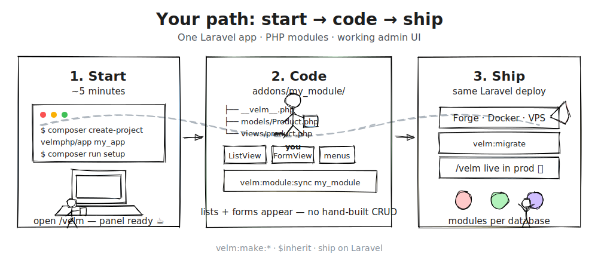

# Velm

<p align="center">
  <a href="https://github.com/velmphp/velm/actions/workflows/ci.yml"></a>
  <a href="https://codecov.io/gh/velmphp/velm"></a>
  <a href="https://packagist.org/packages/velmphp/framework"></a>
  <a href="https://packagist.org/packages/velmphp/framework/stats"></a>
  <a href="./LICENSE"></a>
</p>

<p align="center">
  <strong>Odoo-like modules on Laravel.</strong>
</p>

Velm is a modular ERP framework for PHP: installable modules per database, a recordset ORM, declarative view arch, and a Livewire admin shell. Built on **Laravel 13**, **Livewire 4**, and **PHP 8.3+**. Packages publish as [`velmphp/*`](https://packagist.org/packages/velmphp/) on Packagist.

Semantic port of [PyVelm](https://github.com/coolsam726/pyvelm).

<p align="center">
  <a href="https://velmphp.github.io/velm/docs/next/intro#developer-journey">
    
  </a>
</p>

**Start** → `create-project` & setup · **Code** → models & views in `addons/` · **Ship** → normal Laravel deploy

## Quick start

```bash
composer create-project velmphp/app my_app
cd my_app && composer run setup
```

Open `/velm` and sign in with `admin@velm.test` / `password`.

## Documentation

**[velmphp.github.io/velm](https://velmphp.github.io/velm/)** — installation, models, views, and module authoring.

Monorepo preview: `cd website && npm install && npm start`

## This repository

Development monorepo for `velmphp/*` packages (`packages/`) and bundled modules (`packages/modules/modules/`). Runnable demo app: [`apps/demo/`](./apps/demo/README.md).

```bash
composer install
composer test
```

## License

MIT — see [LICENSE](./LICENSE).
